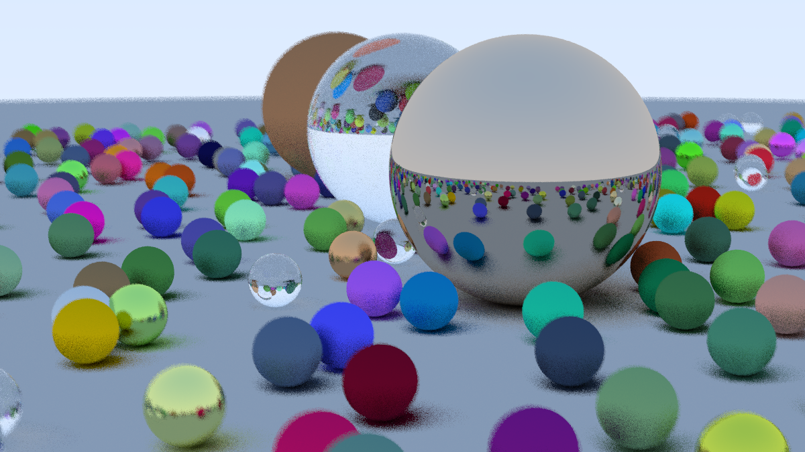

# Ray Tracing in One Weekend

A small personal C++ ray tracer built while following Peter Shirley's
[Ray Tracing in One Weekend](https://raytracing.github.io/books/RayTracingInOneWeekend.html)
tutorial in December 2025.



The project implements diffuse, metal, and dielectric materials, anti-aliasing,
gamma correction, a configurable camera, and depth of field. It renders a
procedurally generated sphere scene as a PPM image.

## Build and render

```sh
cmake -S . -B build
cmake --build build --target Main
./build/Main > render.ppm
```

Built with C++20 and CMake. Shadow and defocus behaviour still have a few known
rough edges.
